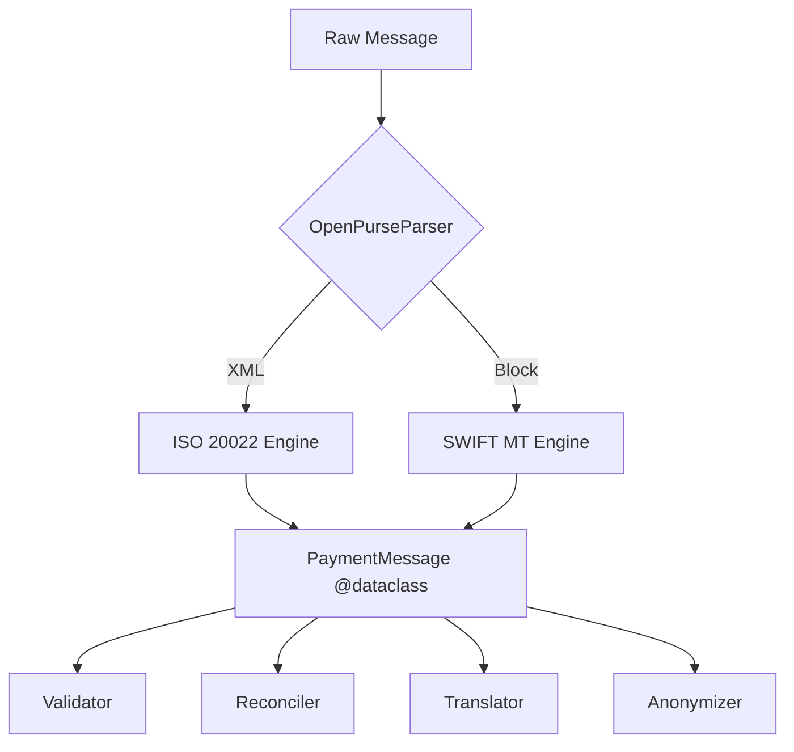

<p align="center">
  
</p>

<h1 align="center">OpenPurse</h1>

<p align="center">
  <strong>The Ultra-Lightweight ISO 20022 & SWIFT MT Engine for Modern Finance</strong>
</p>

<p align="center">
  <a href="https://pypi.org/project/openpurse/"></a>
  <a href="https://github.com/WDibble/OpenPurse/blob/main/LICENSE"></a>
  
</p>

---

## ⚡️ Why OpenPurse?

Financial messaging is messy. Deeply nested XML (ISO 20022) and archaic block-based formats (SWIFT MT) shouldn't slow down your engineering team. **OpenPurse** flattens the complexity into clean, structured Python objects.

- **🚀 Performance-First**: Built on `lxml` for lightning-fast parsing.
- **🛡️ Production-Hardened**: Handles malformed inputs, Unicode, and huge amounts gracefully.
- **🔌 Context-Aware**: Automatically identifies schema versions (770+ ISO namespaces supported).
- **📦 Zero Bloat**: No `pandas`, no `pydantic`. Just pure, native Python `@dataclasses`.

---

## 🛠️ Features at a Glance

| Feature             | Description                                                                  |
| :------------------ | :--------------------------------------------------------------------------- |
| **Unified Parser**  | One API for both ISO 20022 XML and SWIFT MT103/MT202/MT940.                  |
| **Auto-Reconciler** | Link initiations, status reports, and notifications into a single lifecycle. |
| **PII Anonymizer**  | Scrub sensitive data while keeping messages valid (checksum-aware).          |
| **Smart Validator** | Offline IBAN Modulo-97 and BIC validation.                                   |
| **Translator**      | Bidirectional conversion between MX and MT formats.                          |
| **Exporter**        | Generate OpenAPI 3.0 specs directly from your financial models.              |

---

## 🏗️ Architecture



---

## 🚀 Quick Start

### 1. Installation

```bash
pip install openpurse
```

### 2. Basic Parsing

```python
import openpurse

# Works for both XML and legacy SWIFT MT!
data = b"{1:F01BANKUS33XXX...}{4::20:MSG001...}"
parser = openpurse.OpenPurseParser(data)

# Get a structured, typed object
msg = parser.parse()

print(f"💰 {msg.currency} {msg.amount} from {msg.debtor_name}")
```

### 3. Smart Anonymization (Safe for Testing)

```python
from openpurse.anonymizer import Anonymizer

# Scrub PII but keep the IBAN checksums VALID
safe_data = Anonymizer().anonymize_xml(raw_xml_bytes)
```

---

## 🛡️ Reconciliation Engine

Link a `pain.001` initiation to a `camt.054` notification with zero sweat.

```python
from openpurse.reconciler import Reconciler

# Build a chronological timeline of a payment's life
timeline = Reconciler.trace_lifecycle(my_seed_msg, all_parsed_messages)

for step in timeline:
    print(f"[{step.__class__.__name__}] {step.message_id}")
```

---

## 📊 Exporting Models

Need to build a REST API? Export OpenPurse models to OpenAPI in seconds.

```bash
./scripts/export_schema.py --output openapi.json
```

---

## 🧪 Testing and Quality

OpenPurse is verified against **777+ ISO schemas** and real-world edge cases.

```bash
pytest tests/
```

---

<p align="center">
  Built with ❤️ for modern financial engineering.
</p>
